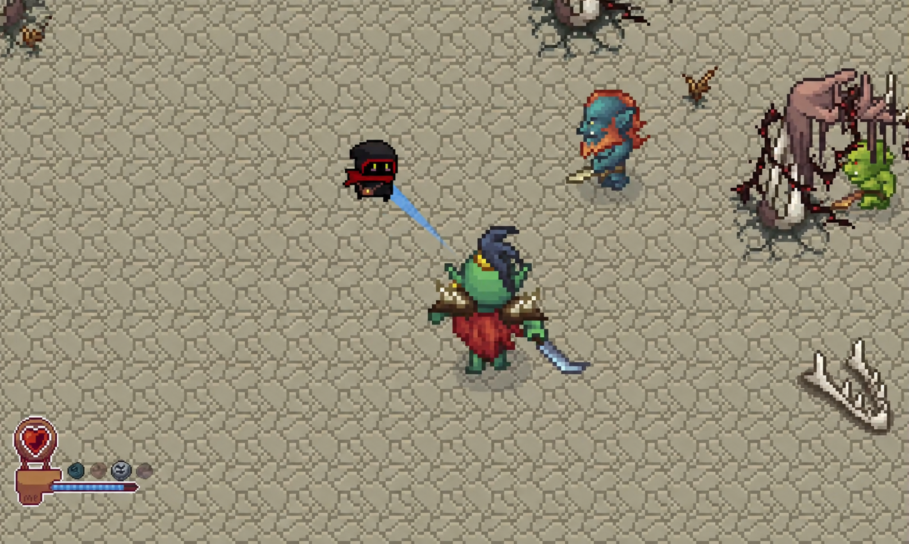
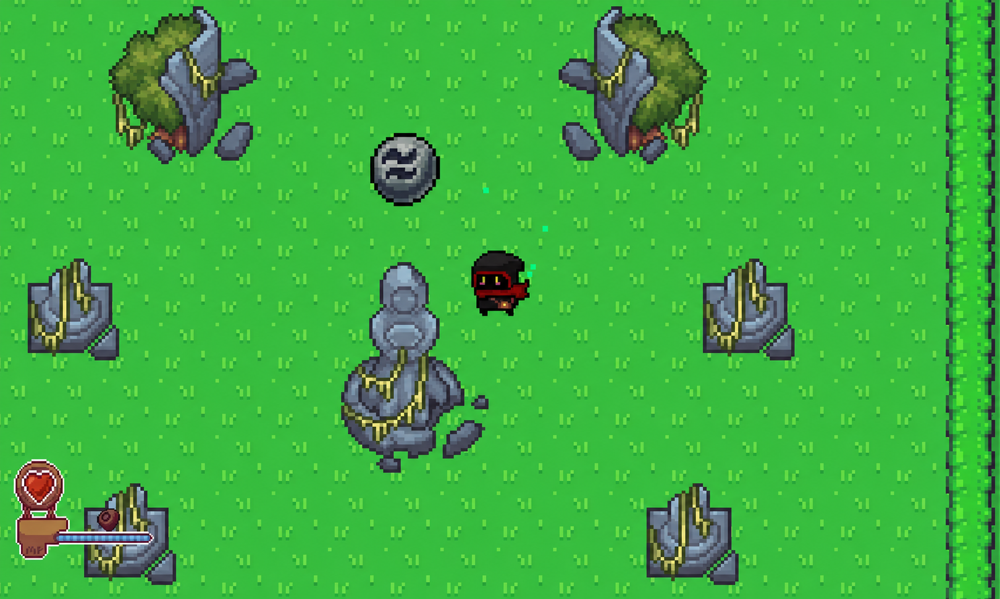
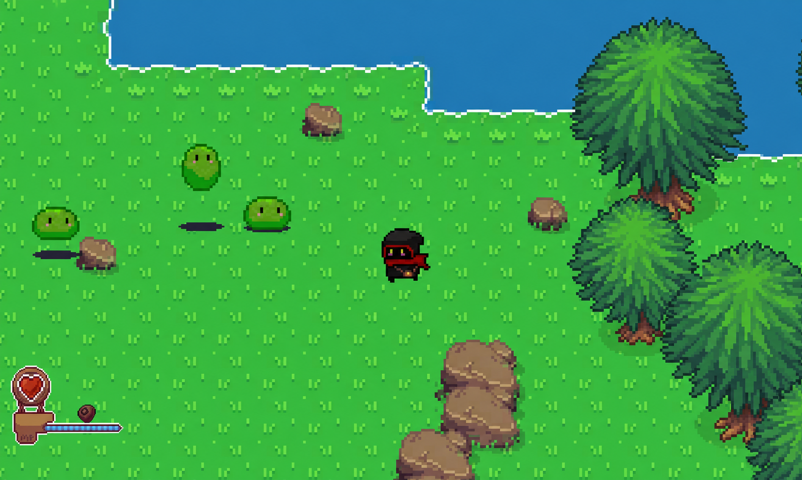
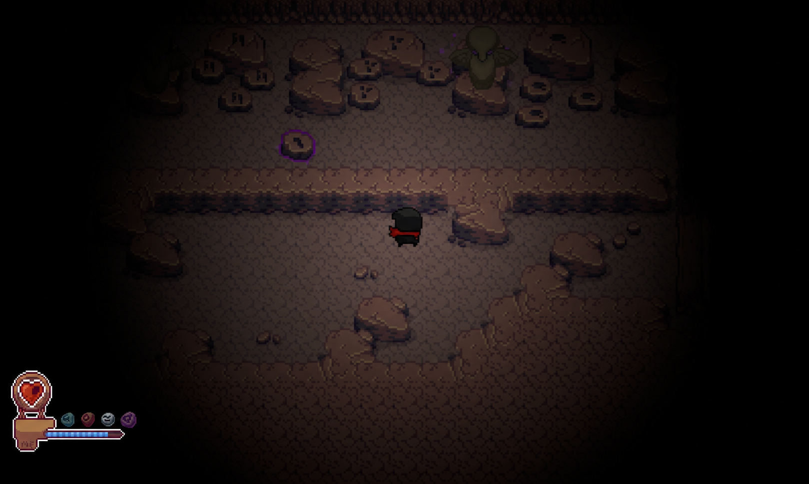
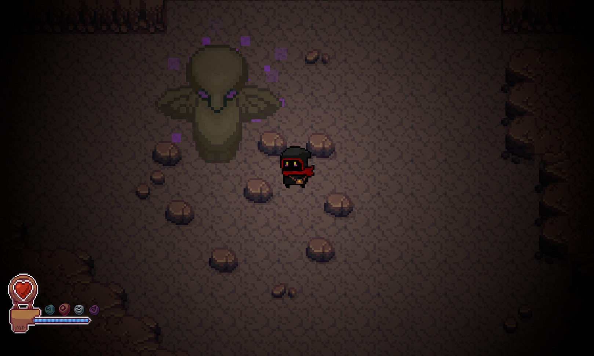
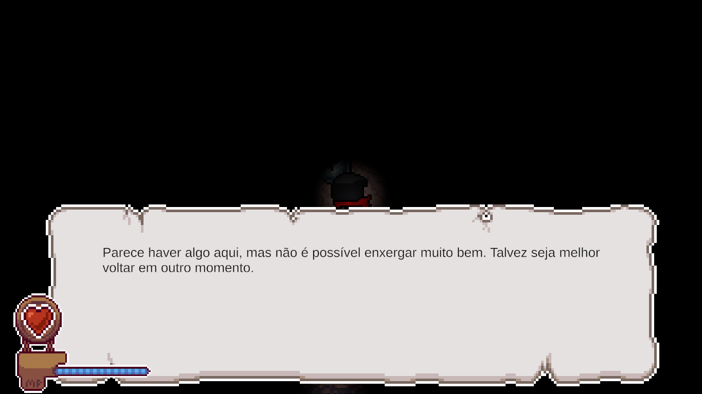
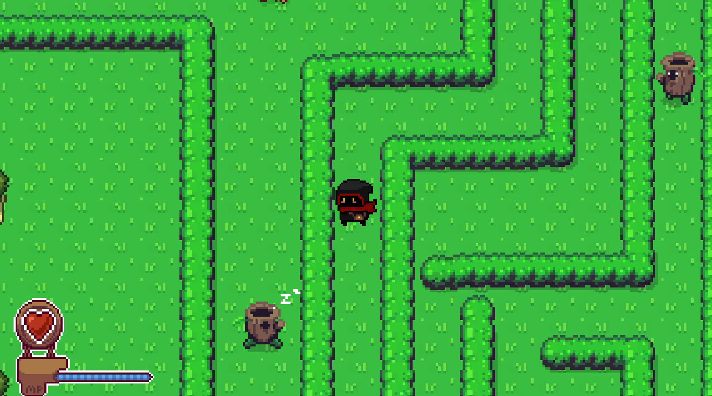

# Forgotten Sigils

Forgotten Sigils is a 2D top-down action-adventure RPG prototype built with Unity and C#. Progression centers on discovering Sigils—runes that unlock combat abilities, movement options, and new ways to interact with the environment.

<p align="center">
  
</p>

## Overview

Explore an overworld of ruins and hostile creatures before descending into a dark cave. Along the way, collected Sigils expand the player's toolkit: they provide ranged spells, melee combat, healing, a dash, improved visibility, and abilities used to clear or manipulate obstacles.

The project is a playable learning prototype focused on connecting exploration, combat, environmental puzzles, and persistent progression across multiple areas.

## Gameplay

- Explore tilemap-based outdoor and cave environments across interconnected scenes.
- Discover seven Sigils: Fire, Wind, Force, Dash, Heal, Light, and Melee.
- Aim spells with the mouse, cycle between unlocked spells, and manage regenerating mana.
- Fight slimes, charging log creatures, multiple orc variants, and a King Orc boss that can dash and summon minions.
- Use abilities outside combat to clear grass, break cave walls, move engraved rocks, activate totems, and illuminate dark areas.
- Track health, mana, unlocked runes, and dash cooldown through the in-game HUD.

## Screenshots

<table>
  <tr>
    <td width="50%">
      
      <br><sub>Discovering a Sigil in the overworld</sub>
    </td>
    <td width="50%">
      
      <br><sub>Overworld exploration and slime enemies</sub>
    </td>
  </tr>
  <tr>
    <td width="50%">
      
      <br><sub>Force-based rock puzzle</sub>
    </td>
    <td width="50%">
      
      <br><sub>Activated cave totem and 2D lighting</sub>
    </td>
  </tr>
  <tr>
    <td width="50%">
      
      <br><sub>Dialogue and visibility-gated exploration</sub>
    </td>
    <td width="50%">
      
      <br><sub>Hedge-maze exploration and charging enemies</sub>
    </td>
  </tr>
</table>

## Controls

| Action | Input |
| --- | --- |
| Move | `WASD` or arrow keys |
| Aim | Mouse cursor |
| Cast selected spell | Left mouse button |
| Select previous / next spell | `Q` / `E` |
| Melee attack (after unlocking) | Right mouse button |
| Interact / collect a Sigil | `R` |
| Dash (after unlocking) | Left `Shift` |
| Channel healing (after unlocking) | Hold `F` |
| Advance dialogue | `E` |
| Release a Force-controlled object | Left mouse button or `Esc` |

## Technical Highlights

- **Reusable ability model:** a shared `BaseMagic` abstraction supports targeted abilities with individual mana costs and casting behavior; unlocks are reflected in both the player controller and rune HUD.
- **Persistent scene state:** a `DontDestroyOnLoad` game manager carries player position, health, mana, unlocked abilities, defeated encounters, and environmental changes between areas.
- **Combat and enemy behaviors:** reusable damage handling is combined with physics, animation, knockback, proximity aggro, charging enemies, timed spawning, and a multi-action boss encounter.
- **Ability-driven environment:** spells interact with 2D physics and tilemaps to remove obstacles, control movable rocks, solve detector-and-totem puzzles, and reveal dark spaces.
- **Player feedback systems:** heart and segmented mana displays, rune selection, dash cooldown, typewriter dialogue, particles, sound effects, and camera transitions communicate game state.

## Built With

- Unity `6000.0.84f1`
- C#
- Universal Render Pipeline with the 2D Renderer and `Light2D`
- Unity 2D physics, Tilemaps, Animator, and Particle System
- Unity UI and TextMesh Pro
- Unity Input Manager APIs for runtime controls

## Scenes

```text
Menu  →  StartingArea  ↔  Cave
```

- **Menu** — start screen and persistent audio settings; begins the game in `StartingArea`.
- **StartingArea** — overworld exploration, early Sigils, enemy encounters, environmental obstacles, and the orc boss area.
- **Cave** — low-light dungeon containing movable-rock and totem puzzles, destructible paths, additional Sigils, and exits back to the overworld.

## Running Locally

1. Clone the repository:

   ```bash
   git clone https://github.com/Ed1l3udo/Forgotten-Sigils.git
   cd Forgotten-Sigils
   ```

2. Install Unity `6000.0.84f1` through Unity Hub.
3. Add the cloned directory as an existing project and open it with that exact editor version.
4. Open `Assets/Scenes/Menu.unity`.
5. Enter Play Mode.

## Project Status

Forgotten Sigils is a learning project and gameplay prototype, not a finished game. Its implemented loop demonstrates exploration, ability-based progression, combat, puzzles, scene transitions, UI, audio, and 2D lighting.

## Credits

Repository history records project contributions from [Ed1l3udo](https://github.com/Ed1l3udo) and [Gabriel Matias de Almeida](https://github.com/mgabrielalmeida). Individual roles are not documented clearly enough to assign ownership of specific disciplines or assets.

Third-party resources with attribution included in the repository:

- LPC-derived terrain tiles and contributors — see the [included attribution](Assets/Game/Sprites/lpc-tileset-16x16/attribution.txt) and [LPC terrain credits](Assets/Game/Sprites/lpc-tileset-16x16/LPC_Terrain_Attribution.txt).
- Press Start 2P — licensed under the [SIL Open Font License 1.1](Assets/Fonts/Press%20Start%202P/OFL.txt).
- LeanTween by Dented Pixel — used for menu selection animation and distributed under its [included license](Assets/Others/LeanTween/License.txt).
- A* Pathfinding Project by Aron Granberg — bundled with its [included project notice](Assets/AstarPathfindingProject/Readme.txt).
